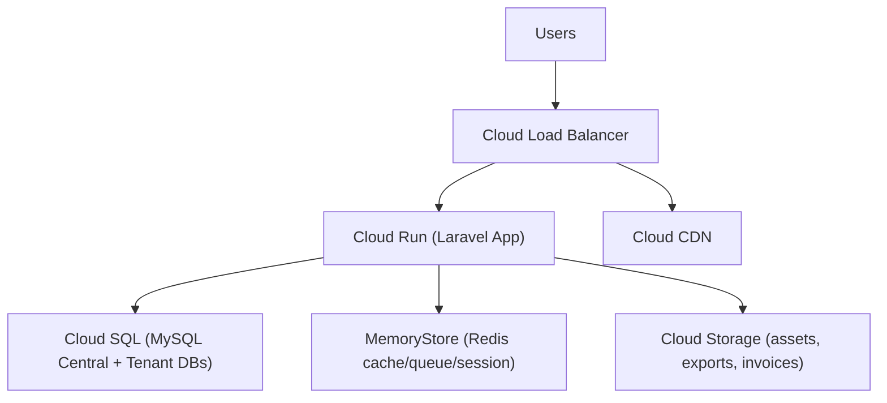

# TSA Legacy Business OS - Enterprise Architecture

## Core Stack
- Laravel 12
- PHP 8.3 (container runtime)
- MySQL (Cloud SQL)
- Redis (MemoryStore)
- Tailwind CSS + Alpine.js
- REST API + Sanctum
- Stancl Tenancy (subdomain multi-tenancy)

## Multi-Tenant Design
- Central database:
  - `tenants`, `domains`, `plans`, `feature_flags`, `plan_feature_flags`, `subscriptions`, `payments`, `webhook_events`, `audit_logs`, `login_activities`
- Tenant database (per tenant):
  - `users`, `roles`, `permissions`, ERP tables (inventory, sales, purchase, CRM, accounting, HR, reports)
- Tenant routing:
  - `tenant.tsalegacy.shop` initialized via `InitializeTenancyByDomainOrSubdomain`
- Central routing:
  - restricted to `TENANCY_CENTRAL_DOMAINS`

## Security Layers
- CSRF protection enabled for all web forms
- API and login rate limiting
- Password hashing via Laravel `hashed` cast
- Signature verification for Razorpay payment + webhook
- Security headers middleware (HSTS, CSP, X-Frame-Options, etc.)
- Audit trail and login monitoring persisted centrally

## Google Cloud Runtime Topology

